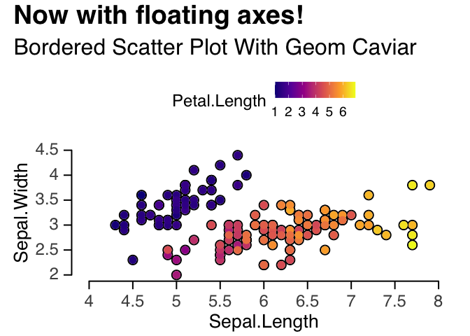

`ohmyggplot`
===

Your ggplot2 with better defaults.

- Changed default discrete and continuous color pallete
- Changed the default `geom_point` to shape 21
- Fine-tuned text size for publication-ready plot
- Fixed `coord_cartesian` with `expand <- FALSE` and `clip <- "off"`

Without `ohmyggplot`
--------

```
library(ggplot2)
library(patchwork)

p1 = ggplot(iris) +
  geom_point(aes(Sepal.Length, Sepal.Width, color = Petal.Length), alpha = 0.8) +
  theme(legend.position = "top") +
  labs(title = "A dull plot, isn't it?")

p2 = ggplot(iris) +
  geom_point(aes(Sepal.Length, Sepal.Width, color = Species), alpha = 0.8)

p1 + p2
```


With `ohmyggplot`
-----

```
library(ohmyggplot)

#initiate ohmyggplot
oh_my_ggplot()

p = ggplot(iris) +
  geom_point(aes(Sepal.Length, Sepal.Width, fill = Petal.Length), alpha = 0.8) +
  theme(legend.position = "top") +
  labs(title = "A better plot, without extra code!") +
  better_fill_legend
p
```


Even better with [`ggRetro`](https://github.com/albert-ying/ggRetro)
-----------------

```
library(ggRetro)

## 
## Attaching package: 'ggRetro'

## The following object is masked from 'package:ohmyggplot':
## 
##     oh_my_ggplot

ggRetro::base_mode(p) +
  theme(legend.position = "top") +
  labs(title = "Now with floating axes!")

## [1] "Both numeric"
```


The default descret color is also changed to Nature Publication Group style, from `ggsci::npg`
----------------------------------------------------------------------------------

```
ggRetro::base_mode({
  ggplot(iris) +
  geom_point(aes(Sepal.Length, Sepal.Width, fill = Species), alpha = 0.8)
}) +
  theme(legend.position = "top")

## [1] "Both numeric"
```



Installation
------------

```
remotes::install_github("albert-ying/ohmyggplot")
# Or
devtools::install_github("albert-ying/ohmyggplot")
```

Why not make it a theme?
------------------------

Some modifications cannot be simply wrapped into a theme function (e.g. `coord_cartesian`)

Inspirations
------------

I'm lazy. I want a good default setting for casual plotting with a minimum amount of code. This is all it is about. Now I just need to put `ohmyggplot::oh_my_ggplot()` in my `.Rprofile`

Suggestions and PRs are welcome!

This package is inspired by Dr. Cédric Scherer's talk [ggplot2
Wizardry](https://www.youtube.com/watch?v=5KHvEXYtnOo&ab_channel=UseROslo)

The default theme is built on
[`hrbrthemes`](https://github.com/hrbrmstr/hrbrthemes).

The default color is from [`ggsci`](https://nanx.me/ggsci/)
# ohmyggplot
