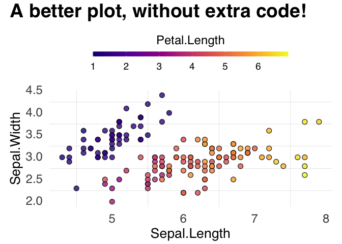

# `ohmyggplot`

Your ggplot2 with better defaults.

## Without `ohmyggplot`

    library(ggplot2)
    library(patchwork)

    p1 = ggplot(iris) +
      geom_point(aes(Sepal.Length, Sepal.Width, color = Petal.Length), alpha = 0.8) +
      theme(legend.position = "top") +
      labs(title = "A dull plot, isn't it?")

    p2 = ggplot(iris) +
      geom_point(aes(Sepal.Length, Sepal.Width, color = Species), alpha = 0.8)

    p1 + p2

## With `ohmyggplot`

    library(ohmyggplot)

    #initiate ohmyggplot
    oh_my_ggplot()

    p = ggplot(iris) +
      geom_point(aes(Sepal.Length, Sepal.Width, fill = Petal.Length), alpha = 0.8) +
      theme(legend.position = "top") +
      labs(title = "A better plot, without extra code!") +
      better_fill_legend
    p

## New geoms: `geom_caviar`

    p = ggplot(iris, aes(Sepal.Length, Sepal.Width)) +
      geom_caviar(aes(color = Petal.Length)) +
      theme(legend.position = "top") +
      labs(subtitle = "Bordered scatter plot with geom_caviar") +
      better_fill_legend
    p

## Even better with `ggRetro`

    library(ggRetro)

    ggRetro::base_mode(p) +
      theme(legend.position = "top") +
      labs(title = "Now with floating axes!")

    ## [1] "Both numeric"

## The default descret color is also changed to Nature Publication Group style, from `ggsci::npg`

    ggRetro::base_mode({
      ggplot(iris) +
      geom_point(aes(Sepal.Length, Sepal.Width, fill = Species), alpha = 0.8)
    }) +
      theme(legend.position = "top")

    ## [1] "Both numeric"

## Installation

    remotes::install_github("albert-ying/ohmyggplot")
    # Or
    devtools::install_github("albert-ying/ohmyggplot")

## Acknowledgements

This package is inspired by Dr. Cédric Scherer’s talk [{ggplot2}
Wizardry](https://www.youtube.com/watch?v=5KHvEXYtnOo&ab_channel=UseROslo)

The default theme is build on
[`hrbrthemes`](https://github.com/hrbrmstr/hrbrthemes).

The default color is from [`ggsci`](https://nanx.me/ggsci/)
